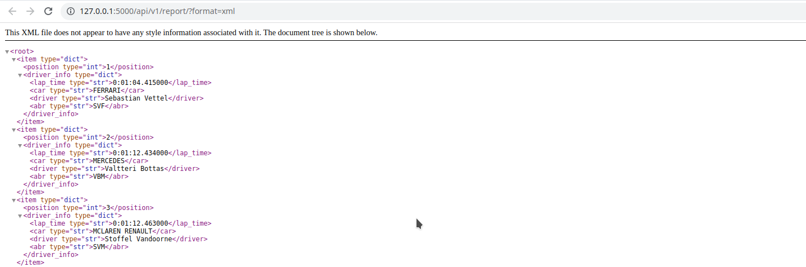

### TASK 8 - REST API report of Monaco 2018 Racing

####  Folder road_data must be placed in project root directory.


### Install
```sh
 python -m pip install --upgrade pip
 python -m pip install -r requirements.txt
```
#####

#### Install pre-commit
```sh
pre-commit install
```
#####
#### Check migrate from .pre-commit-config.yaml
```sh
pre-commit migrate-config
```
#####

##### Check isort flake8 hooks
```sh
pre-commit run --all-files
```
####
### Start flask app
````
python app.py
````
#####

## Examples:

#### http://127.0.0.1:5000/apidocs/


#### http://127.0.0.1:5000/api/v1/report/?format=json


#### http://127.0.0.1:5000/api/v1/report/?format=xml


#### http://127.0.0.1:5000/api/v1/drivers/?format=xml&order=desc


#### http://127.0.0.1:5000/api/v1/drivers/?format=xml&order=asc


#### http://127.0.0.1:5000/api/v1/drivers/?format=json&order=asc


#### http://127.0.0.1:5000/api/v1/drivers/?format=json&order=desc


#### http://127.0.0.1:5000/api/v1/drivers/driver_id=SVF?format=xml


#### http://127.0.0.1:5000/api/v1/drivers/driver_id=SVF?format=json


#### http://127.0.0.1:5000/report


#### http://127.0.0.1:5000/drivers/


#### http://127.0.0.1:5000/drivers/?order=desc


#### http://127.0.0.1:5000/drivers/driver_id=SVF

